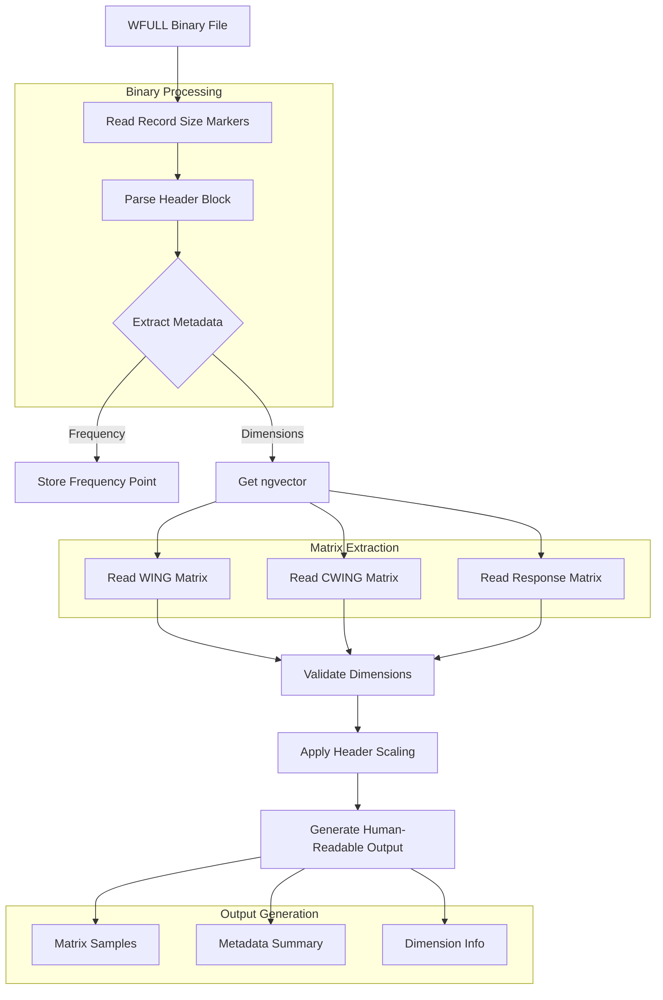

# WFULL File Parsing Strategy

This document details the strategy and methodology used to parse VASP's WFULL files, which contain frequency-dependent screened Coulomb interaction data.

## Parsing Flow

## File Structure Details

### Header Block
- 18 floating-point values
- First value: frequency indicator
- Remaining values: scaling factors and metadata

### Matrix Components
1. **WING Matrix** (ngvector × 3)
   - Off-diagonal corrections
   - G-vector interactions

2. **CWING Matrix** (ngvector × 3)
   - Complementary corrections
   - Ensures proper symmetry

3. **Response Matrix** (ngvector × ngvector)
   - Core dielectric response
   - Full ε⁻¹(G,G',ω) representation

## Implementation Notes

### Record Size Handling
- Each data block is wrapped with 4-byte size markers
- Markers are used to verify data integrity
- Helps maintain Fortran unformatted sequential I/O compatibility

### Dimension Validation
- Matrix dimensions are verified before operations
- ngvector determines the size of all matrices
- Ensures data consistency across the file

### Output Format
The human-readable output includes:
1. Frequency point and metadata summary
2. Matrix dimensions and shapes
3. Sample blocks from each matrix
4. Scaling factors applied

## Physical Interpretation

The parsed data represents the screened Coulomb interaction W(G,G',ω), which is constructed from:
1. The bare Coulomb potential v(G-G')
2. The inverse dielectric function ε⁻¹(G,G',ω)
3. Various corrections and symmetry terms

This data is crucial for:
- GW calculations
- Auger recombination rates
- Dynamic screening effects
